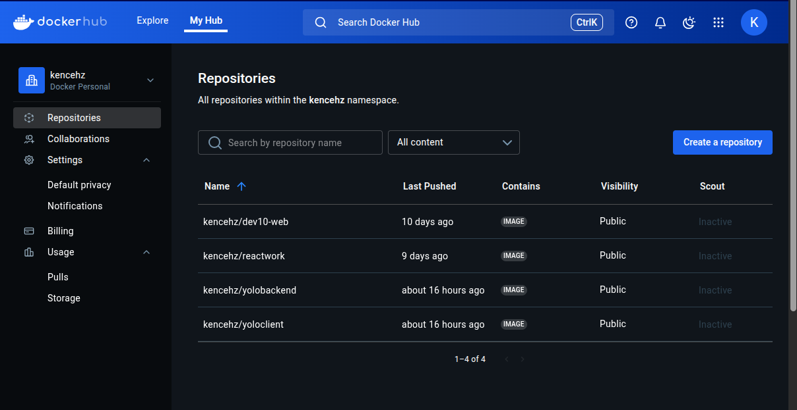

# Overview
This project involved the containerization and deployment of a full-stack yolo application using Docker.

# Requirements
Docker Engine

Vagrant

VirtualBox

kubectl

Minikube (if running locally)
Install the docker engine here:
- [Docker](https://docs.docker.com/engine/install/) 

## How to launch the application 

git clone https://github.com/kentechcomps/yolo.git

start vagrant

vagrant up --provision

deploy kubernetes 
kubectl apply -f manifests/
or

  CHOICE OF IMAGE

   # Frontend (React) kencehz/yoloclient:v1.0.0

    ** Node-14  - Containes all build command needed
    ** Alpine - alpine:3.16.7 - This provides the base image linux which is lightweiht in naturre

   ## Backend (Nodejs)  kencehz/yolobackend:v1.0.0

    ** Node-14  - Containes all build command needed
    ** Alpine - alpine:3.16.7 - This provides the base image linux which is lightweiht in nature
